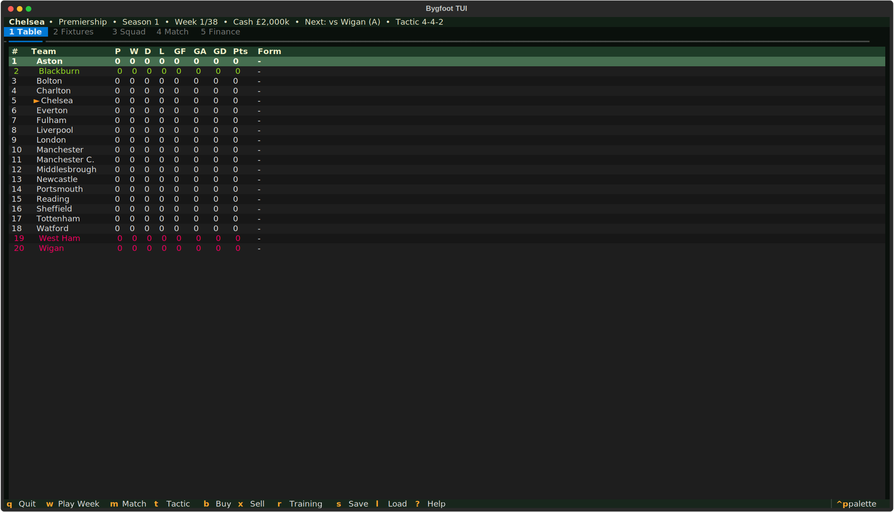
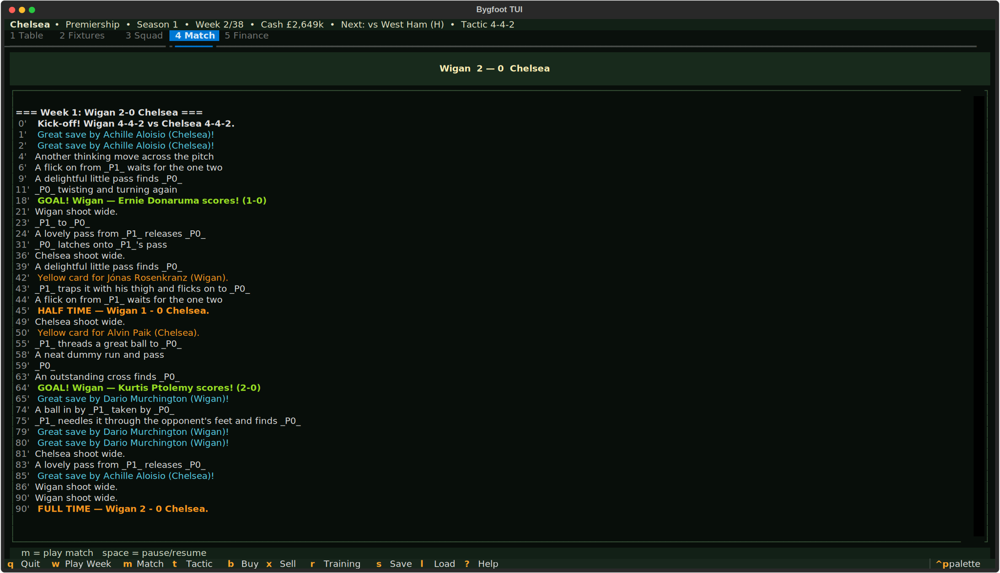
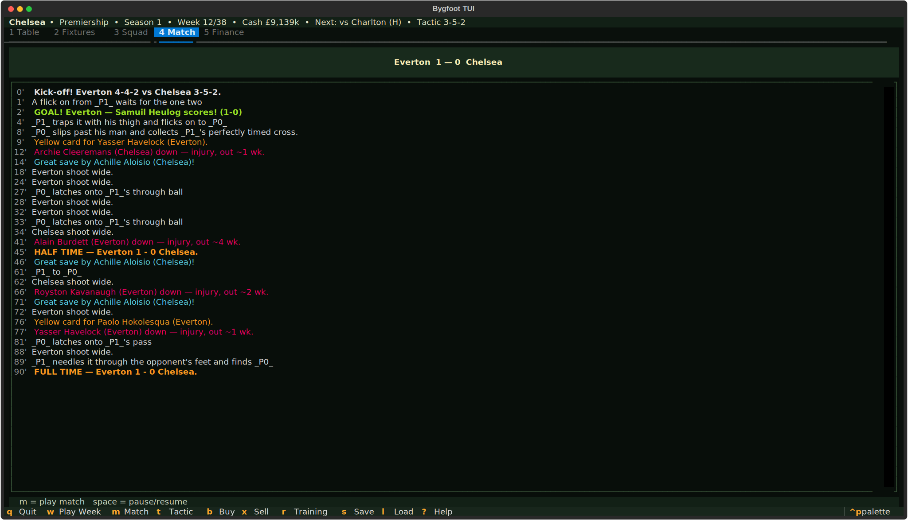

# bygfoot-tui
Take them all the way to the top.





## About
A full football season in your terminal. Sign players, run training, draft tactics, live-ticker through the match, haggle in the transfer window, hunt promotion, avoid the drop. Multi-league, multi-cup, save/load, REST API for agent managers who want to scout by script. All the melodrama of Championship Manager, none of the mouse pointer.

## Screenshots


## Install & Run
```bash
git clone https://github.com/akakabrian/bygfoot-tui
cd bygfoot-tui
make
make run
```

## Controls
<Add controls info from code or existing README>

## Testing
```bash
make test       # QA harness
make playtest   # scripted critical-path run
make perf       # performance baseline
```

## License
MIT

## Built with
- [Textual](https://textual.textualize.io/) — the TUI framework
- [tui-game-build](https://github.com/akakabrian/tui-foundry) — shared build process
